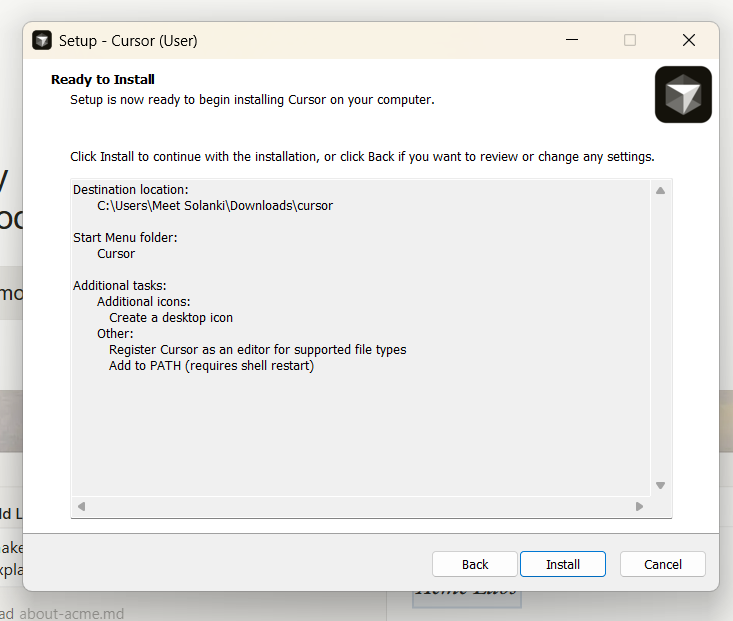
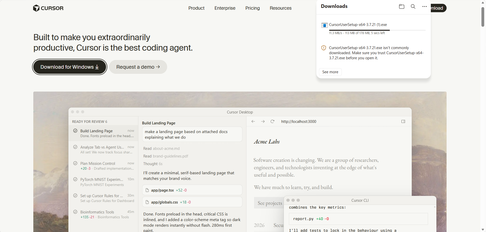
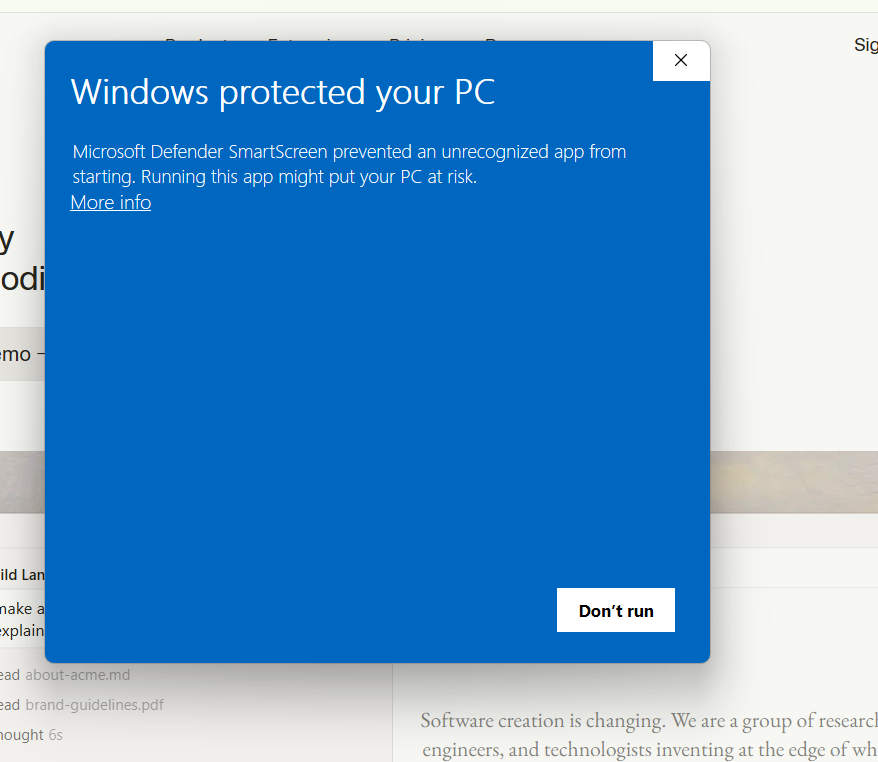
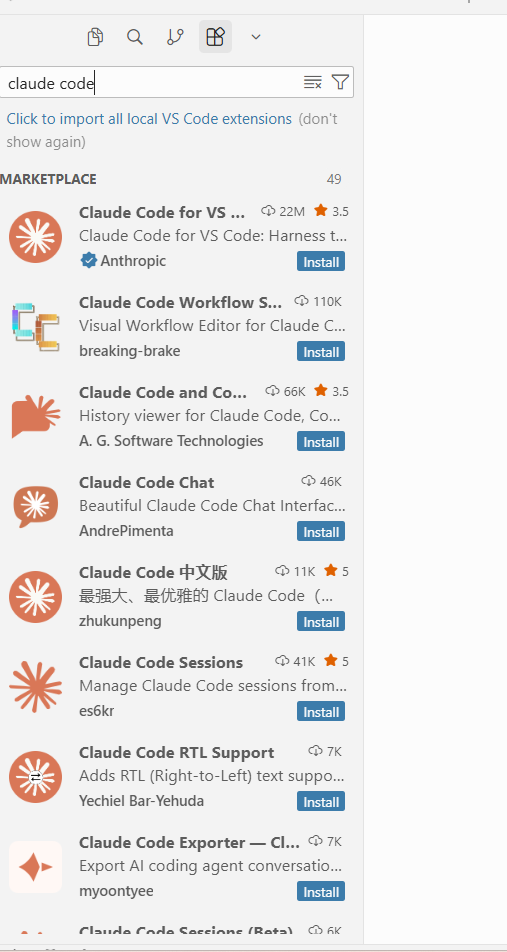
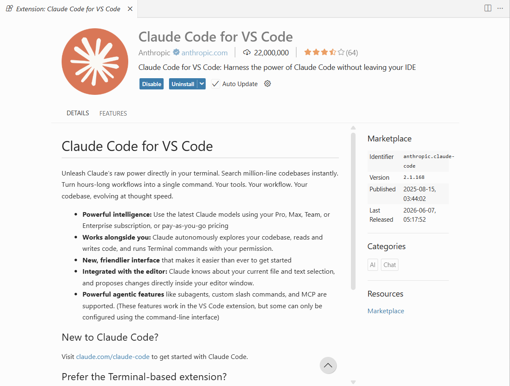
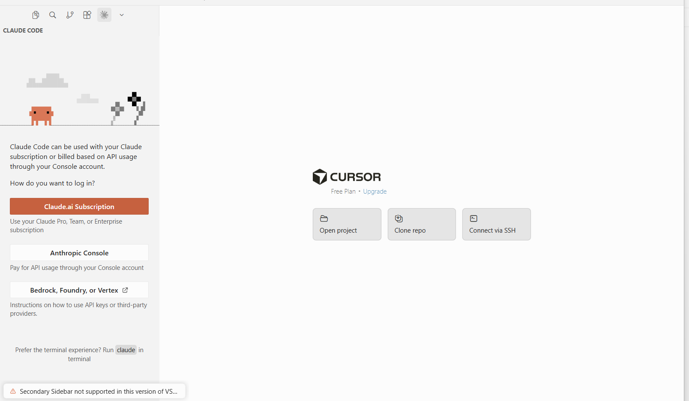
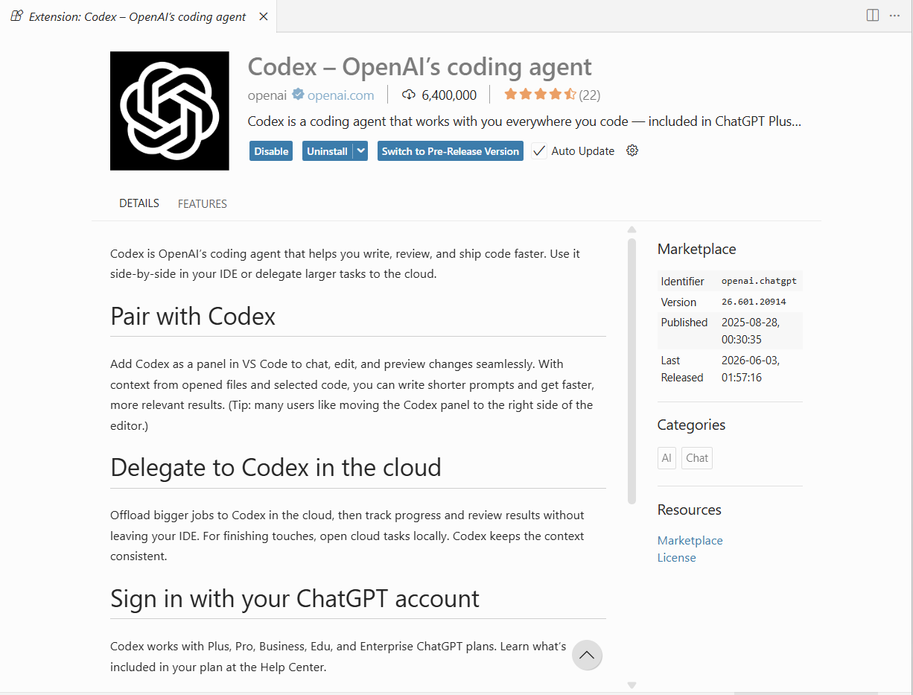
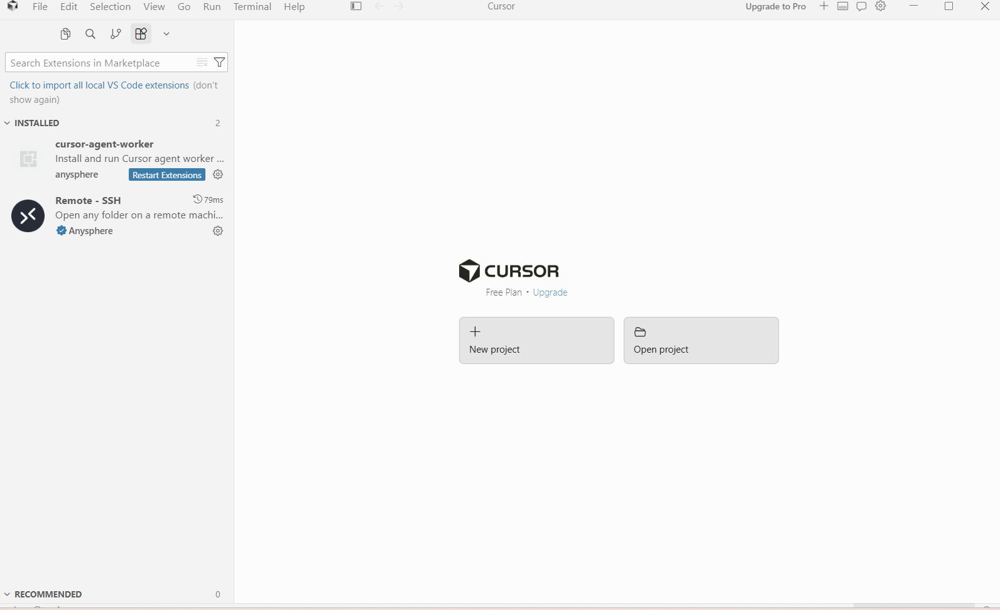
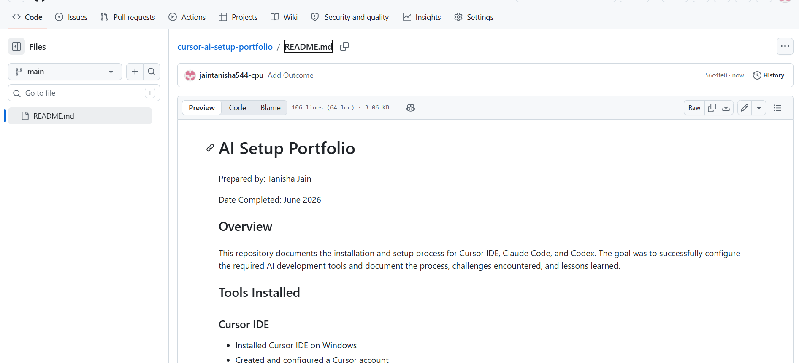

# AI Setup Portfolio

Prepared by: Tanisha Jain

Date Completed: June 2026

## Overview

This repository documents the installation and setup process for Cursor IDE, Claude Code, and Codex. The goal was to successfully configure the required AI development tools and document the process, challenges encountered, and lessons learned.

## Tools Installed

### Cursor IDE
- Installed Cursor IDE on Windows
- Created and configured a Cursor account
- Connected GitHub integration

### Claude Code
- Installed the official Claude Code for VS Code extension by Anthropic
- Verified successful installation
- Opened and explored the Claude Code interface

### Codex
- Installed the official Codex extension by OpenAI
- Verified successful installation
- Reviewed available Codex capabilities and configuration options

## Steps Completed

1. Downloaded Cursor IDE from the official website.
2. Installed Cursor IDE on Windows.
3. Created and configured a Cursor account.
4. Connected GitHub integration.
5. Accessed the Cursor Extension Marketplace.
6. Installed Claude Code extension.
7. Opened and verified Claude Code functionality.
8. Installed Codex extension.
9. Verified successful Codex installation.
10. Created a public GitHub repository.
11. Documented the setup process in this README.

## Challenges Encountered

### Challenge 1: Incomplete Download

The initial Cursor download appeared as a `.crdownload` file, indicating the download had not completed successfully.

**Solution:**
- Deleted the incomplete download.
- Downloaded the installer again from the official Cursor website.
- Verified the installer downloaded completely before launching.

### Challenge 2: Windows Defender SmartScreen Warning

Windows displayed a SmartScreen warning when launching the Cursor installer.

**Solution:**
- Verified the installer was downloaded from the official Cursor website.
- Reviewed the security prompt.
- Proceeded with installation after validation.

### Challenge 3: Locating Extensions

The Cursor interface differed from some online tutorials, making it initially difficult to locate the Extensions Marketplace.

**Solution:**
- Explored the Cursor interface.
- Opened the full editor window.
- Accessed the Extensions Marketplace and installed the required extensions.

## What I Learned

Through this project, I learned how to:

- Install and configure modern AI development environments.
- Navigate and use Cursor IDE.
- Work with AI-powered coding assistants.
- Troubleshoot software installation issues.
- Research solutions independently.
- Document technical work clearly and professionally.

## Outcome

This project introduced me to AI-assisted development tools and modern workflows. While some of these tools were new to me, I was able to research, troubleshoot, and complete the setup successfully. The experience reinforced the importance of independent learning, documentation, and problem-solving when working with unfamiliar technologies.

Successfully completed installation and setup of:

- Cursor IDE
- Claude Code
- Codex

All required tools were installed and verified successfully.

# Screenshots

## Installing Cursor IDE

## Download Issue (.crdownload File)

## Windows Defender SmartScreen Warning

## Claude Code Search Results

## Claude Code Successfully Installed

## Claude Code Interface

## Codex Successfully Installed

## Cursor Workspace

## Final Repository

## Personal Reflection

This project was my first hands-on experience configuring AI-assisted development tools in a professional workflow. Throughout the process I encountered installation issues, security prompts, and configuration challenges that required independent research and troubleshooting.

Completing this project improved my understanding of AI-powered development environments, GitHub workflows, and the importance of clear technical documentation. It also reinforced the value of adaptability and continuous learning when working with unfamiliar technologies.
